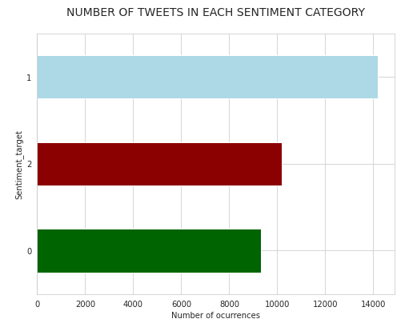

# Twitter Sentiment Analysis
Sentiment analysis on multi-lingual tweets with **accuracy 0.801**

## Task
This is an entity-level sentiment analysis dataset of twitter, which could be found by this link:   https://www.kaggle.com/jp797498e/twitter-entity-sentiment-analysis  
 
Given a message and an entity. The task is to judge the sentiment of the message about the entity.   There are three classes in this dataset: Positive, Negative and Neutral. Messages that are not relevant regarded as Neutral.  

## Notebooks
- [`tf-idf-twi-sentiment-analysis.ipynb`](https://raw.githubusercontent.com/Teasotea/TweetSentimentClassifier/main/tf-idf-twi-sentiment-analysis.ipynb) - Notebook with the best accuracy score, reached with LinearSVC (accuracy = 0.801)
- [`tf-idf-twi-sentiment-analysis_2.ipynb`](https://github.com/Teasotea/TweetSentimentClassifier/blob/main/tf-idf-twi-sentiment-analysis_2.ipynb)- Notebook with feature engineering and preprocessing steps (accuracy = 0.77, reached with LinearSVC)
- [`sentiment-analysis-using-transformers.ipynb`](https://github.com/Teasotea/TweetSentimentClassifier/blob/main/sentiment-analysis-using-transformers.ipynb) - Notebook with Transformers (accuracy = 0.503)

